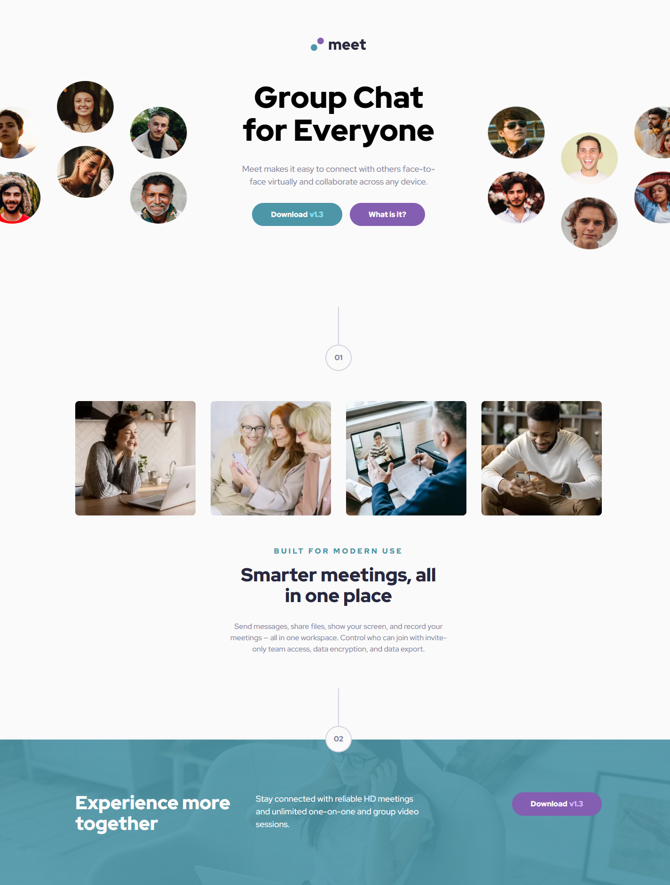
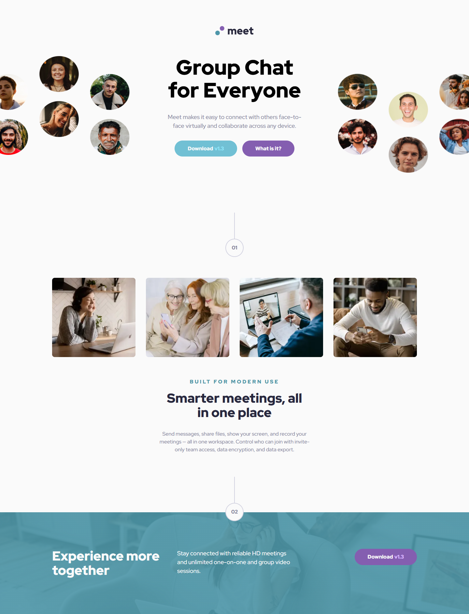
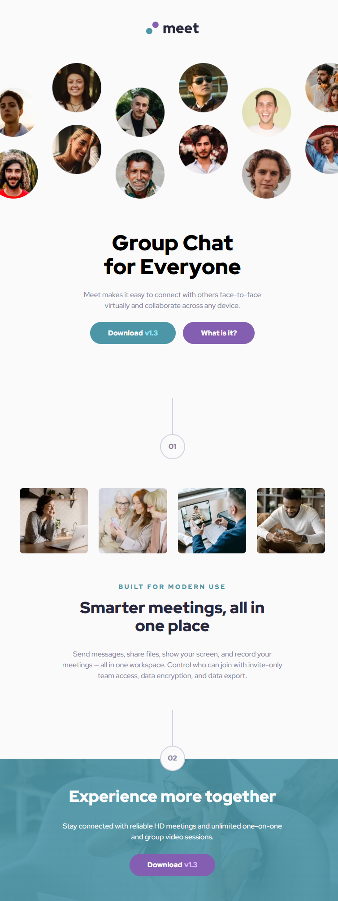
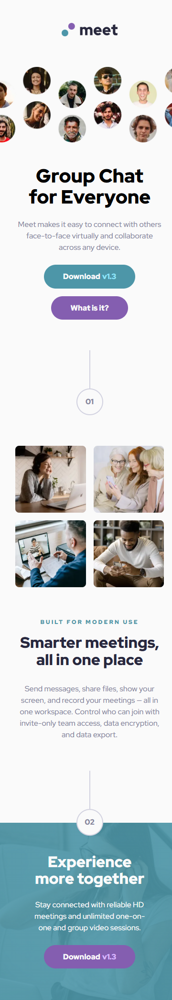

# Frontend Mentor - Meet landing page solution

This is a solution to the [Meet landing page challenge on Frontend Mentor](https://www.frontendmentor.io/challenges/meet-landing-page-rbTDS6OUR). Frontend Mentor challenges help you improve your coding skills by building realistic projects.

---

## Table of contents

- [Overview](#-overview)
  - [The challenge](#-the-challenge)
  - [Screenshot](#-screenshot)
    - [Desktop](#desktop)
    - [Tablet](#tablet)
    - [Mobile](#mobile)
  - [Links](#-links)
- [My Process](#️-my-process)
  - [Architecture](#️-architecture)
  - [Design Tokens System](#-design-tokens-system)
  - [Responsive Image Strategy](#-responsive-image-strategy)
  - [Responsive Strategy](#-responsive-strategy)
  - [Built With](#-built-with)
  - [Performance Optimization](#-performance-optimization)
  - [Accessibility Considerations](#-accessibility-considerations)
  - [What I Reinforced](#-what-i-reinforced)
  - [Future Improvements](#-future-improvements)
  - [Useful Resources](#-useful-resources)
  - [AI Collaboration](#-ai-collaboration)
- [Author](#-author)
- [Acknowledgments](#-acknowledgments)

---

## 📋 Overview

This project recreates the Meet Landing Page using semantic HTML and a scalable CSS architecture based on CUBE CSS principles combined with BEM methodology.

The main focus was:

- Building a structured token system
- Separating layout from components
- Implementing responsive images correctly
- Improving Lighthouse performance
- Maintaining clean architectural boundaries

---

## 🎯 The challenge

Users should be able to:

- View the optimal layout depending on their device's screen size
- See hover states for interactive elements

---

## 📸 Screenshot

### Desktop



### Hover States



### Tablet



### Mobile



---

## 🔗 Links

- Solution URL: [Add solution URL here](https://your-solution-url.com)
- Live Site URL: [https://berefire.github.io/meet-landing-page/](https://berefire.github.io/meet-landing-page/)

---

## ⚙️ My Process

This project followed a mobile-first approach, progressively enhancing layout and image behavior across breakpoints.

A major focus was optimizing image delivery using `srcset`, `sizes`, and `<picture>` while ensuring Lighthouse performance improvements.

---

### 🏗️ Architecture

The project follows the CUBE CSS methodology:

```html
css/
├── base/
│   ├── fonts.css
│   ├── reset.css
│   ├── global.css
│   └── tokens.css
│
├── composition/
│   ├── grid.css
│   ├── stack.css
│   ├── cluster.css
│   ├── box.css
|   └── center.css
│
├── blocks/
│   ├── hero.css
│   ├── features.css
│   ├── cta.css
|   ├── step.css
│   └── button.css
│
├── utilities/
│   └── text.css
|
├── exceptions/
│   └── exceptions.css
|
└── main.css
```

---

### Layer Responsibilities

- **Base** → Tokens, reset, global typography and fonts
- **Composition** → Layout primitives (grid, stack, cluster, box and center)
- **Blocks** → Independent components (hero, features, cta, step and button)
- **Utilities** → Small helper (text-align)
- **Exceptions** → Special cases (exceptions)

This separation ensures:

- Layout does not leak into components
- Components remain portable
- Tokens drive visual consistency

---

### 🎨 Design Tokens System

The design system is powered by:

#### Primitive tokens

- Raw spacing scale
- Color values
- Font sizes
- Font weights

Example:

```css
:root {
  --space-300: 1.5rem;
  --space-400: 2rem;
  --fw-bold: 900;
}
````

#### Semantic tokens

- Section spacing
- Stack spacing
- CTA padding
- Text roles

Example:

```css
:root {
  --space-section-block-start: var(--space-800);
  --text-heading-xl: 2.5rem;
}
```

---

### 🖼 Responsive Image Strategy

A major improvement in this project was implementing accurate responsive images.

Key improvements:

- Measured real rendered sizes using DevTools
- Generated optimized image variants
- Used correct sizes values based on layout

---

### 📐 Responsive Strategy

- **Mobile:** Single column layout
- **Tablet:** Grid adjustments with structured spacing
- **Desktop:** Three-column hero layout with cropped media

Media queries were used for global layout shifts, while layout primitives handled spacing consistency.

Container queries were tested but not applied globally since layout changes depended on viewport width.

---

### 🛠 Built With

- Semantic HTML5
- CSS Custom Properties
- CUBE CSS architecture
- BEM methodology
- CSS Grid
- Flexbox
- Logical properties
- Mobile-first workflow
- Responsive images (`srcset`, `sizes`, `<picture>`)
- Lighthouse performance optimization
- WebP image format

---

### 🚀 Performance Optimization

Performance improvements included:

- Replacing large images with properly scaled variants
- Fixing aspect-ratio mismatch warnings
- Removing oversized image downloads
- Improving performance score from ~91 to optimized state

---

### ♿ Accessibility Considerations

- Proper heading hierarchy
- Decorative images marked appropriately
- Meaningful alt attributes
- Logical property usage for better scalability
- Clear button labeling

---

### 📚 What I Reinforced

- Accurate use of `srcset` and `sizes`
- Measuring rendered size before optimizing images
- Separating layout and component logic
- Implementing semantic design tokens
- Performance-driven development
- Architectural thinking over visual-only styling

---

### 🔮 Future Improvements

- Introduce `@layer` organization
- Expand semantic token abstraction
- Add container queries selectively
- Introduce automated image generation workflow

---

### 📖 Useful resources

- [https://gwfh.mranftl.com/fonts](https://gwfh.mranftl.com/fonts) - Amazing place to obtain fonts of any type.
- [https://squoosh.app/](https://squoosh.app/) - This site helps you to convert any image with a format and size desired.
- [https://web.dev/learn/design](https://web.dev/learn/design) Good place to find any information about responsive design.

---

### 🤖 AI Collaboration

During this project, I used ChatGPT as a collaborative assistant to refine architectural decisions, optimize responsive images, and debug complex CSS behavior.

#### How I Used AI

- Improving Lighthouse performance by correctly scaling image variants.
- Refining semantic token naming and CUBE CSS structure.
- Debugging layout issues related to aspect-ratio, object-fit, and container queries.
- All suggestions were validated using DevTools before implementation.

#### What Worked Well

- AI helped explain browser behavior (especially responsive images).
- It supported architectural thinking rather than just generating code.
- It accelerated debugging without replacing manual validation.

#### What Didn’t Work Well

- Early assumptions about breakpoints instead of measuring actual rendered sizes.
- Over-reliance on theoretical values before testing in DevTools.

Overall, AI served as a conceptual guide and reviewer, while all implementation and validation were handled manually.

---

## 👤 Author

- Frontend Mentor - [@berefire](https://www.frontendmentor.io/profile/berefire)
- GitHub - [@berefire](https://github.com/berefire)

---

## 🙏 Acknowledgments

Thanks to Frontend Mentor for providing realistic challenges that encourage architectural thinking, not just layout replication.
